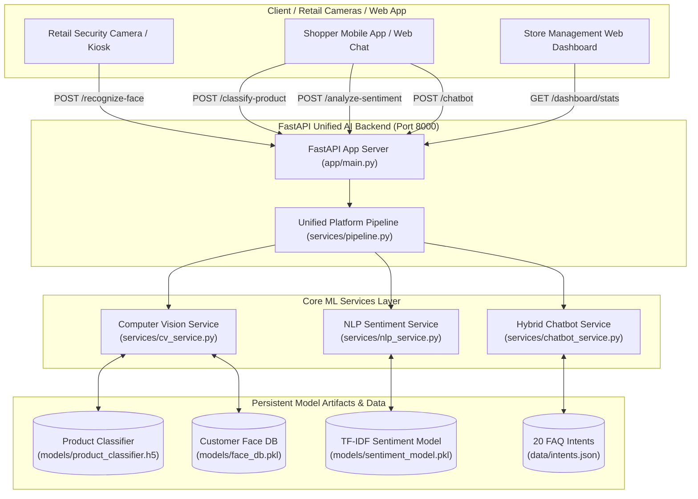

# Smart Retail & Customer Intelligence Platform

[](https://smart-retail-platform-87jb.onrender.com)
[](https://smart-retail-platform-87jb.onrender.com/docs)
[](https://www.python.org/)
[](https://fastapi.tiangolo.com/)
[](https://opencv.org/)
[](https://www.tensorflow.org/)
[](https://www.docker.com/)

An enterprise-grade, multi-modal Machine Learning & Computer Vision platform designed for smart retail analytics, customer footfall identification, automated product classification, customer sentiment analysis, and intelligent conversational customer support.

---

## 🌐 Live Production Deployments

- **Render Live Cloud API**: [https://smart-retail-platform-87jb.onrender.com](https://smart-retail-platform-87jb.onrender.com)
- **Interactive Swagger API Documentation**: [https://smart-retail-platform-87jb.onrender.com/docs](https://smart-retail-platform-87jb.onrender.com/docs)
- **Vercel Deployment**: [https://smart-retail-customer-platform-437yq1hnu-navneet-s-projects1.vercel.app](https://smart-retail-customer-platform-437yq1hnu-navneet-s-projects1.vercel.app)

---

## System Architecture & Data Flow



---

## Directory Structure

```
Smart Retail & Customer Intelligence Platform/
├── app/
│   ├── __init__.py
│   ├── main.py              # FastAPI app server with lifespan model loading
│   ├── schemas.py           # Pydantic data schemas & contracts
│   └── routers/
│       ├── __init__.py
│       ├── cv_router.py     # Vision endpoints (faces, products)
│       ├── nlp_router.py    # Text preprocessing & sentiment endpoints
│       └── chatbot_router.py# FAQ & Chatbot endpoints
├── services/
│   ├── __init__.py
│   ├── cv_utils.py          # OpenCV image ingestion, grayscale, Canny, Haar cascades
│   ├── cv_service.py        # MobileNetV2 Product Classifier & Face Recognition DB
│   ├── nlp_service.py       # Text preprocessor & TF-IDF sentiment analyzer
│   ├── chatbot_service.py   # Rule-Based + TF-IDF Hybrid Chatbot
│   └── pipeline.py          # Unified ML pipeline manager
├── data/
│   ├── intents.json         # 20 Retail FAQ Categories & Patterns
│   ├── raw/                 # Raw datasets (.gitkeep)
│   └── processed/           # Processed feature caches (.gitkeep)
├── models/
│   ├── product_classifier.h5 # MobileNetV2 Keras model
│   ├── face_db.pkl          # Customer facial encodings & visit history
│   ├── sentiment_model.pkl  # Logistic Regression classifier
│   └── vectorizer.pkl       # TF-IDF text vectorizer
├── notebooks/
│   ├── 01_train_product_classifier.py
│   ├── 01_product_classifier_training.ipynb
│   ├── 02_train_sentiment_model.py
│   ├── 02_sentiment_analysis.ipynb
│   └── README.md
├── tests/
│   ├── test_cv_utils.py
│   ├── test_cv_service.py
│   ├── test_nlp_chatbot.py
│   ├── test_unified_pipeline.py
│   └── test_endpoints.py    # Pytest & httpx integration suite
├── Dockerfile               # Production Docker setup (python:3.10-slim)
├── vercel.json              # Vercel serverless deployment config
├── requirements.txt         # Production dependencies
├── .gitignore
└── README.md
```

---

## Quick Start & Setup Guide

### Option 1: Local Virtual Environment

```bash
# 1. Clone repository & navigate to root directory
cd "Smart Retail & Customer Intelligence Platform"

# 2. Create and activate virtual environment
python3 -m venv venv
source venv/bin/activate  # On Windows: venv\Scripts\activate

# 3. Install dependencies
pip install --upgrade pip
pip install -r requirements.txt

# 4. Run model pre-training scripts (Optional - models auto-generate if missing)
python3 notebooks/01_train_product_classifier.py
python3 notebooks/02_train_sentiment_model.py

# 5. Start FastAPI application server
uvicorn app.main:app --reload --host 0.0.0.0 --port 8000
```

Access Swagger Interactive API Docs at: `http://localhost:8000/docs`

---

### Option 2: Docker Container Deployment

```bash
# 1. Build Docker image
docker build -t smart-retail-platform .

# 2. Run Docker container
docker run -d -p 8000:8000 --name retail-ai-container smart-retail-platform

# 3. Verify health status
curl http://localhost:8000/health
```

---

## API Reference & Usage Examples

### 1. Facial Customer Recognition & Visit Logging (`POST /recognize-face`)

**cURL Request:**
```bash
curl -X POST "https://smart-retail-platform-87jb.onrender.com/recognize-face" \
  -H "accept: application/json" \
  -H "Content-Type: multipart/form-data" \
  -F "file=@/path/to/customer_face.jpg"
```

**Python Request:**
```python
import requests

url = "https://smart-retail-platform-87jb.onrender.com/recognize-face"
with open("customer_face.jpg", "rb") as f:
    response = requests.post(url, files={"file": f})

print(response.json())
```

**Sample Response:**
```json
{
  "status": "success",
  "matched": true,
  "customer_id": "CUST-1001",
  "customer_name": "Alice Smith",
  "confidence_score": 0.924,
  "distance": 0.076,
  "total_visits": 4,
  "last_visit": "2026-08-02T23:55:00.123456+00:00",
  "visit_history": [
    "2026-07-20T10:15:00.000000+00:00",
    "2026-07-25T14:30:00.000000+00:00",
    "2026-07-30T11:00:00.000000+00:00",
    "2026-08-02T23:55:00.123456+00:00"
  ]
}
```

---

### 2. Product Classification (`POST /classify-product`)

**cURL Request:**
```bash
curl -X POST "https://smart-retail-platform-87jb.onrender.com/classify-product" \
  -F "file=@/path/to/sneakers.jpg"
```

**Sample Response:**
```json
{
  "status": "success",
  "predicted_category": "shoes",
  "confidence_score": 0.9854,
  "confidence_percentage": 98.54,
  "class_probabilities": {
    "bags": 0.0031,
    "clothing": 0.0052,
    "electronics": 0.0011,
    "groceries": 0.0052,
    "shoes": 0.9854
  }
}
```

---

### 3. Sentiment Analysis (`POST /analyze-sentiment`)

**cURL Request:**
```bash
curl -X POST "https://smart-retail-platform-87jb.onrender.com/analyze-sentiment" \
  -H "Content-Type: application/json" \
  -d '{"text": "Exceptional product quality and super fast shipping!"}'
```

**Sample Response:**
```json
{
  "status": "success",
  "raw_text": "Exceptional product quality and super fast shipping!",
  "clean_text": "exceptional product quality super fast shipping",
  "sentiment": "positive",
  "confidence_score": 0.9621,
  "class_probabilities": {
    "positive": 0.9621,
    "negative": 0.0213,
    "neutral": 0.0166
  }
}
```

---

### 4. Hybrid Chatbot (`POST /chatbot`)

**cURL Request:**
```bash
curl -X POST "https://smart-retail-platform-87jb.onrender.com/chatbot" \
  -H "Content-Type: application/json" \
  -d '{"query": "What is your return policy?", "customer_id": "CUST-1001"}'
```

**Sample Response:**
```json
{
  "status": "success",
  "query": "What is your return policy?",
  "matched_intent": "return_policy",
  "matching_method": "rule_based",
  "confidence": 0.95,
  "response": "We offer a 30-day hassle-free return and exchange policy for unwashed and unused items with original receipts."
}
```

---

### 5. Real-Time Dashboard Analytics (`GET /dashboard/stats`)

**cURL Request:**
```bash
curl -X GET "https://smart-retail-platform-87jb.onrender.com/dashboard/stats"
```

**Sample Response:**
```json
{
  "status": "success",
  "timestamp": "2026-08-03T00:00:00.000000+00:00",
  "customer_analytics": {
    "total_registered_customers": 12,
    "total_logged_visits": 48,
    "recent_customer_activity": [
      {
        "customer_id": "CUST-1001",
        "name": "Alice Smith",
        "total_visits": 4,
        "last_visit": "2026-08-02T23:55:00.000000+00:00"
      }
    ]
  },
  "sentiment_telemetry": {
    "total_analyzed_reviews": 15,
    "counts": {
      "positive": 10,
      "negative": 3,
      "neutral": 2
    },
    "percentages": {
      "positive": 66.67,
      "negative": 20.0,
      "neutral": 13.33
    }
  },
  "models_loaded": {
    "product_classifier": "MobileNetV2 (models/product_classifier.h5)",
    "face_recognition_db": "FaceDB PKL (models/face_db.pkl)",
    "sentiment_analyzer": "TF-IDF + LogisticRegression (models/sentiment_model.pkl)",
    "hybrid_chatbot": "Rule-Based + TF-IDF (data/intents.json)"
  }
}
```

---

## Ethical AI, Data Privacy & Bias Blueprint

### 1. Facial Recognition Ethics & Transparency
- **Non-Surveillance Boundaries**: Facial recognition in retail environments must never be deployed for non-consensual tracking or secret surveillance.
- **Clear Store Signage & Transparency**: Customers entering a retail space equipped with visual intelligence must be informed via clear physical and digital notices explaining what data is captured and how it enhances store assistance.
- **Opt-In Customer Enrollment**: Customer facial identification functions exclusively on an **explicit opt-in basis** (e.g., VIP loyalty program registration).

### 2. Data Privacy & Regulatory Compliance (GDPR / CCPA)
- **Zero Raw Image Storage**: The system **does not store raw customer facial images** in persistent disk databases. Facial images captured during registration or store entry are immediately processed into **128-dimensional floating-point vector encodings**, after which raw pixel arrays are purged from RAM.
- **Data Minimization**: Stored records in `models/face_db.pkl` consist strictly of anonymized ID tags, names, 128D mathematical feature vectors, and ISO visit timestamps.
- **Right-to-Be-Forgotten (Data Erasure)**: In compliance with GDPR Article 17 and CCPA deletion requests, the platform exposes administrative profile deletion methods (`delete_customer_profile`) that permanently erase encodings and historical visit logs upon customer request.

### 3. Algorithmic Bias & Fairness Mitigation
- **Demographic Representation**: Pre-trained facial feature models are susceptible to accuracy disparities across different skin tones, gender identities, and age demographics if training sets lack representation.
- **Mitigation Strategies**:
  1. **Threshold Tuning**: The platform utilizes a conservative distance matching tolerance (`tolerance = 0.6` / confidence bounds) to minimize false positives and misidentifications.
  2. **Multi-Factor Verification**: High-value transactions or sensitive account operations require secondary authentication (SMS OTP or PIN) rather than relying solely on facial encodings.
  3. **Continuous Auditing**: Regular bias audit checks are performed across diverse demographic subgroups to measure equality of false acceptance rates (FAR) and false rejection rates (FRR).

---

## Test Execution

Run the automated integration test suite with `pytest`:

```bash
pytest tests/ -v
```
